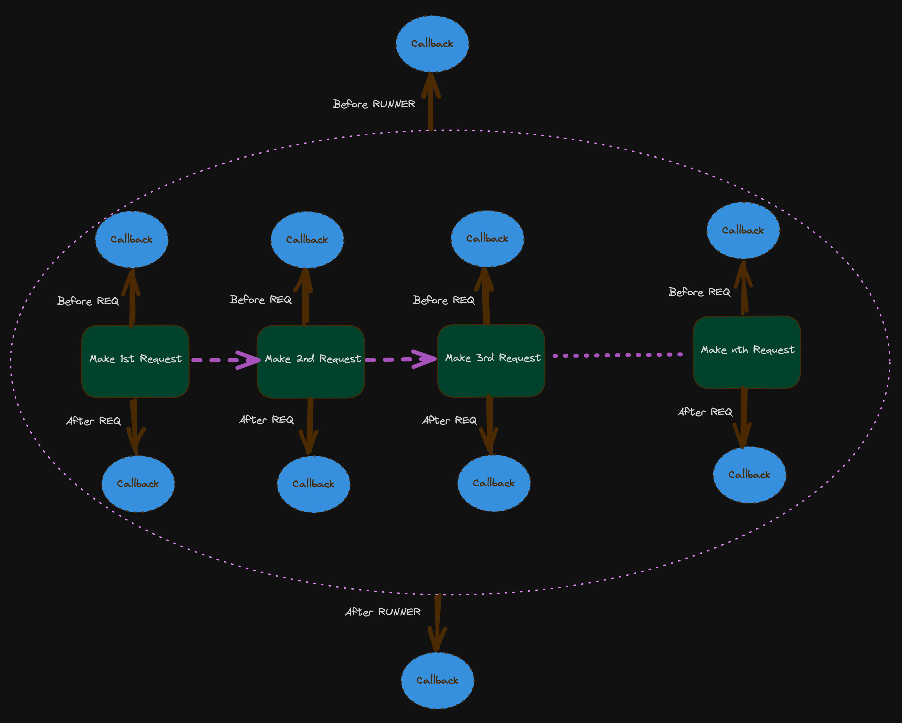

# FastRequest


<!-- WARNING: THIS FILE WAS AUTOGENERATED! DO NOT EDIT! -->

## Install

    pip install FastRequest

## How to use

The dynamic data polutaion is achived by using anonymous functions with
formatted string to fetch Env varibles like `get_env('key')`.

``` python
from FastRequest.ReqRespBunch import *
from FastRequest.RestReqFactory import *
from FastRequest.Runner import *
```

``` python
req1 = RestReqFactory(
    method="GET",
    url_provider= lambda: f"{get_env('url1')}/get",
    params_provider= lambda : {
        "foo1": 'foo1',
        "foo2": "foo2",
    }
)
req2 = RestReqFactory(
    method="GET",
    url_provider= lambda : f"{get_env('url2')}/api/users/2",
)
reqs = ReqRespBunch([req1, req2])
```

``` python
set_env('url1', 'https://postman-echo.com')
set_env('url2', 'https://reqres.in')
```

``` python
runner = Runner()
runner.run(reqs)
```

      0%|          | 0/2 [00:00<?, ?it/s]

## Design

It implows callback sytem both before and after each Rest Request. Which
gives the chanse to weive together the response with the next request
and any required validation. Please consider the below digram.

### Flow Chart


